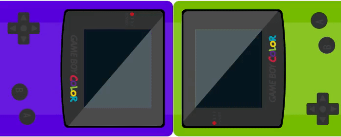

# OctoBoy - VR on GameBoy

This repository contains the source code of the GameBoy demo ROMs for OctoBoy, our 2019 April fool. For more informations, you can read our article (in French):

* https://www.wanadev.fr/170-la-realite-virtuelle-sur-gameboy-cest-desormais-possible-avec-le-casque-octoboy/




## Build Dependencies

* SDCC
* Python
* img2gb (only to run the `make assets` command to rebuild the assets)


## Compiling the ROMs

First, clone this repository and get submodules:

```
git submodule init
git submodule update
```

Then build the GBDK library (this is only required once):

```
cd gbdk-n
make
cd ..
```

Finaly, you can build the ROMs:

```
make
```

This command will generate two ROMs:

* `GBVR_L.gb`: the ROM for the left eye,
* `GBVR_R.gb`: the ROM for the right eye.
